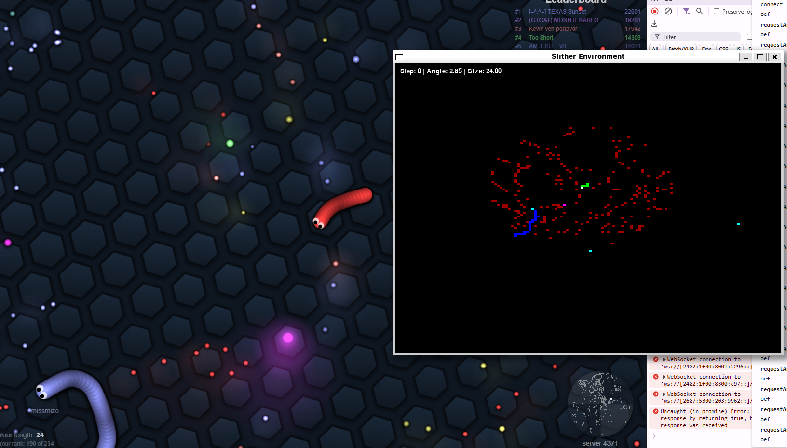

# Slither Gym

Slither Gym is a reinforcement learning environment and model server for training and deploying AI agents in [slither.io](http://slither.io/). The project uses the Stable Baselines3 library for training models and WebSockets for real-time communication between the game client and the server.



## Project Structure

- `src/`: Contains the source code for the environment, model, and server.
  - `__main__.py`: Main entry point for running a trained model on the server.
  - `train.py`: Script for training the model using PPO.
  - `renderer.py`: Renders the game environment.
  - `slither_env.py`: Implements the Slither environment using Gymnasium.
  - `websocket_server.py`: Handles WebSocket connections and model predictions.
  - `utils.py`: Utility functions for the project.

- `client/`: Contains the client-side code for interacting with the server.

## Setup

### Prerequisites

- Python 3.12 or higher
- Poetry for dependency management
- Tampermonkey or Violentmonkey browser extension to inject the client script

### Installation

1. Clone the repository:

   ```bash
   git clone https://github.com/james-stratford/slither-gym.git
   cd slither-gym/gym
   ```

2. Install dependencies using Poetry:

   ```bash
   poetry install
   ```

3. Activate the virtual environment:

   ```bash
   poetry shell
   ```

## Usage

### Training the Model

To train the model, run the following command:

```bash
python src/train.py
```

This will train the model using the PPO algorithm and save it as `output/slither_model.zip`.

The current model used is a Vision Transformer (ViT) for feature extraction and the 'CnnPolicy' policy.

### Client Interaction

The client can connect to the server using WebSockets to send game state updates and receive actions.

## Contributing

Contributions are welcome! Please fork the repository and submit a pull request for any improvements or bug fixes.

## License

This project is licensed under the MIT License. See the [LICENSE](LICENSE) file for details.

## Acknowledgments

- [Stable Baselines3](https://github.com/DLR-RM/stable-baselines3) for the reinforcement learning framework.
- [Gymnasium](https://gymnasium.farama.org/) for the environment interface.
